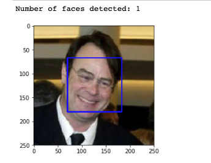

# Dog-Breed-Classifier
#### Using a pre-trained models to detect dogs and humans.
Datasets that were used in this project:-
1. [dog dataset](https://s3-us-west-1.amazonaws.com/udacity-aind/dog-project/dogImages.zip)
2. [human dataset](https://s3-us-west-1.amazonaws.com/udacity-aind/dog-project/lfw.zip).

### Packages that are used this project
- [numpy](https://numpy.org/)
- [matplotlib](https://matplotlib.org/)
- [cv2](https://pypi.org/project/opencv-python/)
- [torch](https://pypi.org/project/torchvision/)

First using the opencv library to detect the human faces
Here is an example
     

## Tried different pretrained models like vgg16, vgg19, and alexnet                                                    

Then decided to build my own CNN with

Not the best results

## Using transfer learning which lead to better results

transfer learning showed better results and adding more epochs can lead much high accuracy

# Final results from the models

